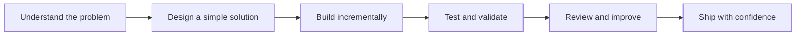

<h1 align="center">Hi, I'm Juan Carlos Gómez 👋</h1>

<p align="center">
  <strong>Software Engineer · Telematics Engineering · Backend & Web Platforms</strong>
</p>

<p align="center">
  I build clean, scalable, and maintainable digital products for real business environments.
</p>

<p align="center">
  <a href="https://github.com/JuanCGomezS">
    
  </a>
  
  
  
</p>

---

## 🚀 About Me

| Area | Summary |
| --- | --- |
| 🎓 Background | Telematics Engineering |
| 💼 Experience | 6+ years building web applications |
| 🏢 Industries | Enterprise, banking, government, insurance, and internal platforms |
| 🧠 Strengths | Clean architecture, backend systems, automation, and maintainable code |
| 🌎 Region | Experience building products for Latin American markets |
| 🤝 Collaboration | Comfortable working with technical and non-technical stakeholders |

I enjoy solving complex business problems with simple, well-designed software. For me, good engineering is not only about writing code — it is about creating systems that teams can understand, evolve, and trust.

---

## 🧩 What I Bring to a Team

| Capability | What it means in practice |
| --- | --- |
| 🏗️ Architecture | I design systems with clear boundaries, readable flows, and long-term maintainability. |
| ⚙️ Backend Engineering | I build reliable APIs, data models, services, background jobs, and integrations. |
| 🎨 Frontend Implementation | I create clean interfaces with practical UI behavior and strong attention to detail. |
| 🔌 Integrations | I connect platforms, external APIs, payment flows, operational tools, and internal systems. |
| 🧪 Quality | I care about testing, code review, observability, and predictable delivery. |
| 🧭 Product Thinking | I look beyond the ticket and focus on the business problem behind the feature. |

---

## 🛠️ Tech Stack

| Backend | Frontend | Data & Infra | Practices |
| --- | --- | --- | --- |
| Python | JavaScript | PostgreSQL | Clean Architecture |
| Django | TypeScript | Redis | SOLID Principles |
| Django REST Framework | Alpine.js | Docker | Automated Testing |
| REST APIs | HTMX | CI/CD | Code Review |
| Background Jobs | Tailwind CSS | Git / GitHub | Agile Delivery |

<p align="center">
  
</p>

---

## 📊 GitHub Activity

<p align="center">
  
</p>

<p align="center">
  
</p>

> Stats cards are useful as a visual snapshot, but the real value is in the repositories, decisions, and consistency behind the work.

---

## 🧠 Engineering Philosophy

| Principle | How I apply it |
| --- | --- |
| Clarity over cleverness | Code should be easy to read, review, and maintain. |
| Architecture with purpose | Structure should reduce complexity, not decorate it. |
| Tests as confidence | A good test suite protects delivery and future changes. |
| Product before technology | The stack matters, but the business problem matters more. |
| Maintainability is a feature | Future developers should not pay for today's shortcuts. |

> Code is not just written for machines.
> It is written for people who will read it, maintain it, and build on top of it.

---

## 📌 Areas of Interest

```text
Software Architecture  ·  Backend Systems  ·  SaaS Platforms
Developer Experience   ·  Automation       ·  AI-assisted Workflows
Internal Tools         ·  FinTech          ·  InsurTech
Process Optimization   ·  Product Engineering
```

---

## 🧭 How I Like to Work



---

## 🤝 Let's Connect

I'm always interested in meaningful software projects, engineering conversations, and opportunities to build products that create real impact.

| Platform | Link |
| --- | --- |
|  | [@JuanCGomezS](https://github.com/JuanCGomezS) |
|  | [LinkedIn](https://linkedin.com/in/juancarlosgomezs) |
| 🌐 | [Portfolio](https://juancgomezs.github.io/Project-3D/) |

---

## ⚡ Fun Fact

I care a lot about writing software that does not become a problem for the next person.

Because in real engineering, the job is not just to make it work today —
the job is to make it understandable tomorrow.
